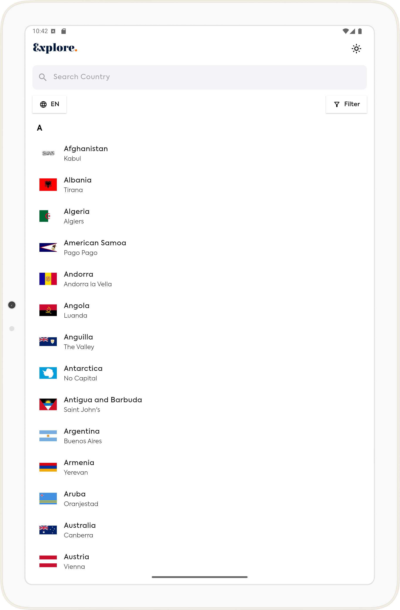
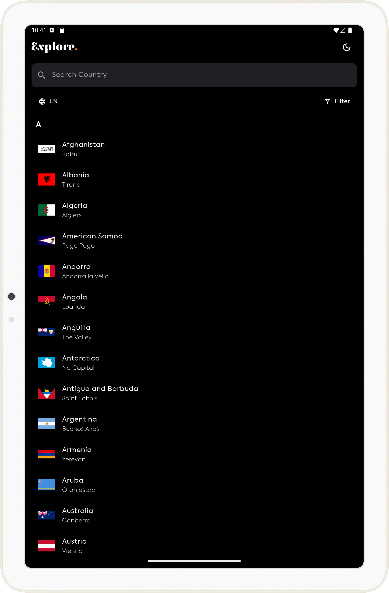
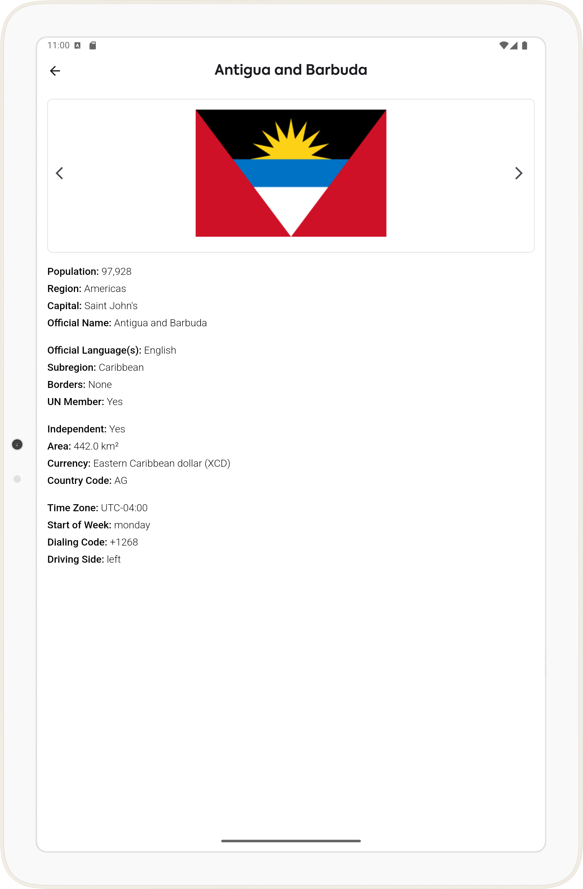
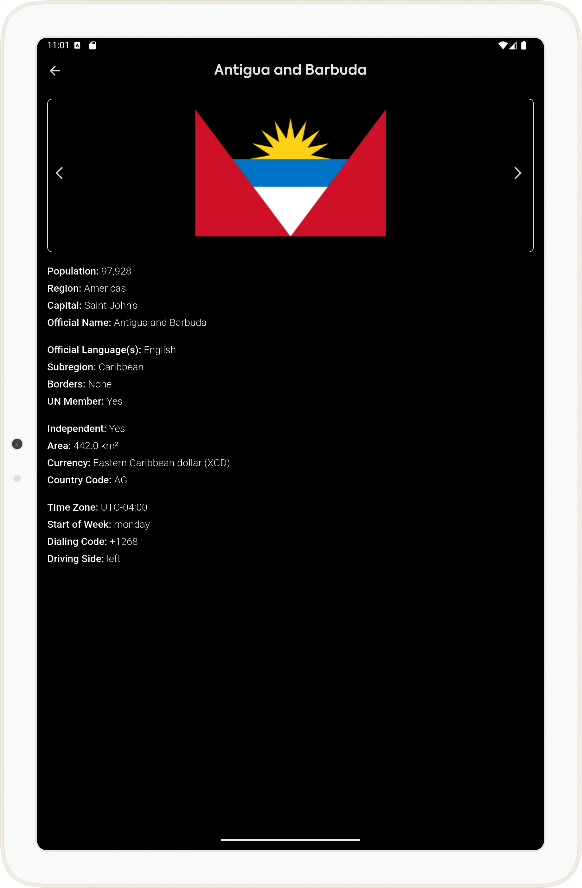

# Country Info App

A Flutter application that provides detailed information about countries, including population, region, time zones, and more.

## 📌 Features
- 🌎 View detailed country information
- 🔍 Search for countries
- 📊 Filter countries by region and time zone
- 🎨 Clean and user-friendly UI

## 🛠️ Tech Stack
- **Frontend:** Flutter (Dart)
- **State Management:** Provider (if needed)
- **Networking:** HTTP package for API calls

## 📸 Screenshots

| Home Screen(Light and Dark modes) |
| ----------- |
<table>
  <tr>
    <td></td>
    <td></td>
  </tr>
</table>

| Country Details(Light and Dark modes) |
| ----------- |
<table>
  <tr>
    <td></td>
    <td></td>
  </tr>
</table>

## 🚀 Getting Started
### Prerequisites
Make sure you have:
- Flutter installed (`flutter doctor` to verify)
- Dart SDK
- A working emulator or physical device

### Installation
Clone the repository and install dependencies:
```sh
 git clone https://github.com/yourusername/country-info-app.git
 cd country-info-app
 flutter pub get
```

### API Key Setup
This app fetches country data from an external API. Access it [here](https://restcountries.com/v3.1/all).

### Running the App
```sh
flutter run
```

## 🌍 Localization (Upcoming Feature)
Localization is planned but not fully implemented yet.
- Future versions will support multiple languages.

## 📁 Project Structure
```
lib/
│── main.dart                   # App entry point
│── screens/
│   ├── home_screen.dart        # Main home screen
│   ├── country_info.dart       # Country details screen
│── widgets/
│   ├── filter_modal.dart       # Filter options
│   ├── language_modal.dart     # Language options
│── services/
│   ├── fetch_countries.dart    # Handles API requests
│── theme/
│   ├── theme_provider.dart     # Handles light or dark mode
│── assets/
│   ├── fonts/                  # App fonts
|   ├── img/                    # App images
```

## 📲 Demo
Try the app on Appetize: [Demo](https://appetize.io/app/b_wghnkhdq7rg4q5qzev64tblk2a)

## 📜 License
This project is licensed under the MIT License - see the [LICENSE](LICENSE) file for details.

## 🤝 Contributing
1. Fork the repository
2. Create a new branch (`git checkout -b feature-branch`)
3. Commit your changes (`git commit -m 'Add new feature'`)
4. Push to the branch (`git push origin feature-branch`)
5. Open a Pull Request
